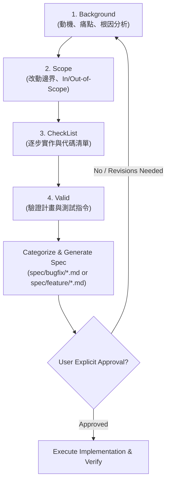

# Spec-First Development Workflow Skill

This skill enforces a disciplined, specification-driven development workflow. It ensures that the agent and the user are completely aligned on the direction, architectural impact, concrete checklist, and verification criteria before touching any code.

---

## 🛑 Strict Gatekeeper Rule: Zero Code Modification Before Approval

> [!CAUTION]
> **HARD GATE**: The agent is **STRICTLY PROHIBITED** from modifying, creating, or deleting codebase source files (e.g., using `replace_file_content` or `write_to_file` on code) or running mutating commands until:
> 1. All 4 phases (**Background**, **Scope**, **CheckList**, **Valid**) have been thoroughly discussed and confirmed with the user.
> 2. The task is categorized as either a **Bug Fix** or a **Feature**, and a formal specification document has been created under:
>    - `spec/bugfix/<spec_name>.md` (for bug fixes, logic corrections, and error patches)
>    - `spec/feature/<spec_name>.md` (for new features, algorithmic enhancements, and capabilities)
> 3. The user has reviewed the specification file and explicitly granted approval (e.g., "Approved", "確認", "可以開始修改", "Proceed").

---

## 🔄 The 4-Phase Spec Alignment Protocol

When discussing a problem, feature, or bug fix with the user, structure the discussion systematically through the following 4 phases:

### Phase 1: Background (背景與問題根因)
1. **Clarify Context**: Gather full understanding of the user's objective, reported bug, or performance bottleneck.
2. **Deep Codebase Exploration**: Use read-only tools (`grep_search`, `find_by_name`, `view_file`, `list_dir`) to inspect relevant files.
3. **Root Cause Analysis (RCA)**:
   - Identify precise file paths and line numbers using clickable links (e.g., [`environment.py:L296-L310`](file:///home/b0457812963/Mamba3RL/SynapseX/Brain/DQN/lib/environment.py#L296-L310)).
   - Analyze mathematical, financial, or state machine issues (e.g., look-ahead bias, reward scale mismatch, unintended state mutations).
   - Formulate a clear "Current Behavior vs. Expected Behavior" contrast.

### Phase 2: Scope (影響範圍與明確邊界)
1. **Target File Scope Matrix**:
   - Explicitly list every file, module, and class that will be modified (**In-Scope**).
   - Explicitly list neighboring components that will **NOT** be modified (**Out-of-Scope**) to guard against regressions.
2. **Interface & Architectural Boundaries**:
   - Check if Gym API signatures, observation spaces, action spaces, or neural network inputs/outputs are affected.
   - Maintain backward compatibility where required.

### Phase 3: CheckList (實作查核清單與改動藍圖)
1. **Ordered Task Checklist**:
   - Break down implementation into granular, sequential steps.
   - Include data structure adjustments, algorithm implementations, and parameter configuration updates.
2. **Codebase Cleanliness & Defensiveness**:
   - Specify removal of dead code, redundant variables, or obsolete comments.
   - Specify defensive checks (assertions, shape validation, type hints).

### Phase 4: Valid (驗證標準與測試計畫)
1. **Runtime Verification Requirement**:
   - In accordance with repository rules, all verification MUST run inside the virtual environment interpreter:
     - Relative path: `../bin/python`
     - Absolute path: `/home/b0457812963/Mamba3RL/bin/python`
2. **Concrete Acceptance Criteria**:
   - Define exact numerical tolerances, expected output metrics, or state transitions.
   - Check against audit logging mechanisms (e.g., `audit_logs/*.jsonl`) if available.
   - Include edge case tests (e.g., empty queues, boundary offsets, wrong trades).

---

## 📄 Specification Markdown Generation Protocol

Once the 4 phases are aligned during conversation:

1. **Category Decision & File Paths**:
   Classify the work into one of the two strict categories:
   - **Bugfix Category** (`spec/bugfix/<spec_name>.md`):
     - For bug fixes, logic defects, data leakage fixes, reward calculation anomalies, mathematical corrections, numerical overflow/underflow, runtime exceptions, and regressions.
     - Example: `spec/bugfix/adjust_environment.md`
   - **Feature Category** (`spec/feature/<spec_name>.md`):
     - For new features, architectural extensions, new neural network backbones, observation features, action spaces, new training strategies, audit monitors, and workflow tools.
     - Example: `spec/feature/step_audit_decorator.md`
   - **Naming Guideline**: Keep filenames concise and descriptive (e.g., `<name>.md`). Do **NOT** prefix filenames with redundant tags like `issue_`, as the parent directory (`bugfix/` or `feature/`) already clearly defines the spec type.

2. **Template Reference**:
   Use the standardized template located at [spec_template.md](./resources/spec_template.md).

3. **Language Standards (Mandatory Repository Rule)**:
   - According to `.agents/rules/rules.md`:
     - **Interactive Conversation**: Conducted in Traditional Chinese (繁體中文) or user's preferred language.
     - **Spec File Content**: MUST be written in English (or bilingual with English as primary technical spec).
     - **Code Links**: All referenced files and code symbols MUST use clickable markdown links (`file:///...`).

---

## 🚦 Post-Generation Procedure

After writing the spec file to `spec/bugfix/<spec_name>.md` or `spec/feature/<spec_name>.md`:
1. Provide the user with a direct clickable link to the generated specification file.
2. Summarize key decisions and highlight any open trade-offs or questions.
3. **STOP** and wait for explicit confirmation from the user.
4. **DO NOT** commence editing codebase files until the user explicitly responds with approval to execute the spec.
