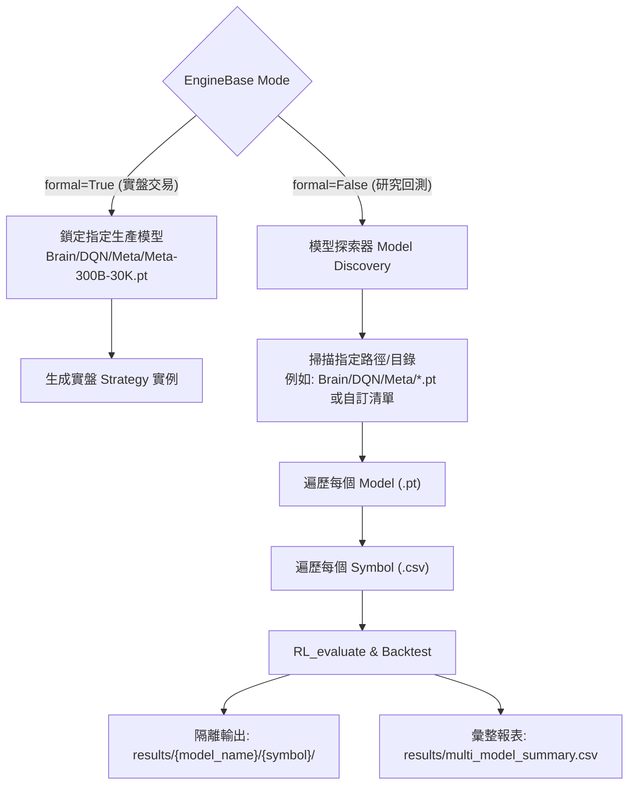

# Specification: Multi-Model Batch Backtesting & Evaluation Framework (多模型批次回測評估架構)

## 📋 Index / 目錄
1. [Requirement & Background / 需求概述與背景](#1-requirement--background--需求概述與背景)
2. [Current Architecture Analysis / 現行架構與限制分析](#2-current-architecture-analysis--現行架構與限制分析)
   - [2.1 模型路徑硬編碼 (Hardcoded Model Path)](#21-模型路徑硬編碼-hardcoded-model-path)
   - [2.2 檔名解析脆弱性 (Fragile Model Name Parsing)](#22-檔名解析脆弱性-fragile-model-name-parsing)
   - [2.3 回測結果目錄衝突 (Result Overwrite on Multi-Model)](#23-回測結果目錄衝突-result-overwrite-on-multi-model)
3. [Architecture & Design Specification / 系統架構與設計規格](#3-architecture--design-specification--系統架構與設計規格)
   - [3.1 正式交易與測試模式職責分工 (Formal vs Test Separation)](#31-正式交易與測試模式職責分工-formal-vs-test-separation)
   - [3.2 智慧模型解析與備援機制 (Smart Model Metadata Parsing)](#32-智慧模型解析與備援機制-smart-model-metadata-parsing)
   - [3.3 多模型 × 多幣種回測評估管線 (Multi-Model × Multi-Symbol Matrix)](#33-多模型--多幣種回測評估管線-multi-model--multi-symbol-matrix)
   - [3.4 隔離輸出與績效排行總表 (Result Directory Isolation & Leaderboard Summary)](#34-隔離輸出與績效排行總表-result-directory-isolation--leaderboard-summary)
4. [Proposed Code Modifications Summary / 預計修改方案彙整](#4-proposed-code-modifications-summary--預計修改方案彙整)
   - [4.1 Target File: Brain/Common/engine.py](#41-target-file-braincommonenginepy)
   - [4.2 Target File: Brain/DQN/lib/Backtest.py](#42-target-file-braindqnlibbacktestpy)
   - [4.3 Target File: DQN_rl_test.py](#43-target-file-dqn_rl_testpy)
5. [Implementation Task Checklist / 實作任務清單](#5-implementation-task-checklist--實作任務清單)
6. [Verification Plan / 驗證計畫](#6-verification-plan--驗證計畫)

---

## 1. Requirement & Background / 需求概述與背景

在強化學習模型研發與訓練過程中（如 DQN、Mamba-DQN、Actor-Critic 等），系統會在 `Brain/DQN/Meta/` 或 `saves/` 目錄下產生多個模型檢查點（Checkpoints，例如 `checkpoint-250.pt`、`checkpoint-350.pt` ... 以及正式上線指定的 `Meta-300B-30K.pt`）。

### 核心業務目標：
1. **正式交易環境 (`formal=True`)**：嚴格鎖定使用指定的正式上線模型（預設為 `Brain/DQN/Meta/Meta-300B-30K.pt`），維持系統穩定性與確定性。
2. **測試/回測環境 (`formal=False`)**：解鎖單一模型限制，支援「一次性批次測試指定目錄下的所有 `.pt` 模型」或「指定模型列表」，自動對所有測試幣種執行回測評估。
3. **績效比較與選模機制 (Model Benchmark & Leaderboard)**：將各模型在全幣種上的回測表現（累積報酬、最大回撤、夏普比率、勝率等）輸出至結構化報表，讓研發人員一目了然各 Checkpoint 的收斂與泛化能力，挑選出優於基準正式模型的 Checkpoint。

---

## 2. Current Architecture Analysis / 現行架構與限制分析

### 2.1 模型路徑硬編碼 (Hardcoded Model Path)
在 [Brain/Common/engine.py](file:///home/b0457812963/Mamba3RL/SynapseX/Brain/Common/engine.py#L79-L105) 的 `strategy_prepare` 中：
```python
if self.formal:
    Meta_model_path = os.path.join("Brain", "DQN", "Meta", "Meta-300B-30K.pt")
    ...
else:
    Meta_model_path = os.path.join("Brain", "DQN", "Meta", "Meta-300B-30K.pt")
    ...
```
無論測試或正式，皆強制指向單一檔案，缺乏外部傳入自定義模型路徑、模型清單或模型目錄的靈活性。

### 2.2 檔名解析脆弱性 (Fragile Model Name Parsing)
在 [Brain/Common/engine.py](file:///home/b0457812963/Mamba3RL/SynapseX/Brain/Common/engine.py#L162-L179) 的 `_parse_model_path` 中：
```python
info, feature, data_part = path.stem.split("-")
feature_len = int(re.findall(r"\d+", feature)[0])
data_len = int(re.findall(r"\d+", data_part)[0])
```
* **缺陷**：僅支援類似 `Meta-300B-30K.pt`（以兩個 `-` 分割出 3 區塊）的命名格式。
* **問題**：若遇到訓練 Checkpoint 檔名如 `checkpoint-250.pt`（僅 1 個 `-`）或自定義檔名如 `model_dueling.pt`，會直接拋出 `ValueError: not enough values to unpack`，導致批次回測中斷崩潰。

### 2.3 回測結果目錄衝突 (Result Overwrite on Multi-Model)
在 [Brain/DQN/lib/Backtest.py](file:///home/b0457812963/Mamba3RL/SynapseX/Brain/DQN/lib/Backtest.py#L219) 中：
```python
self._results_file = self._cwd / "results" / f"{self.strategy.symbol_name}"
```
* **缺陷**：圖片儲存路徑僅以 `symbol_name` 區分（例如 `results/BTCUSDT/`）。
* **問題**：在批次測試多個模型時，後續模型的回測圖表（`closed_position_profit.png`、`max_drawdown.png`、`orders.png`）會直接覆蓋前一個模型的結果，導致無法進行模型間的橫向對比。

---

## 3. Architecture & Design Specification / 系統架構與設計規格

### 3.1 正式交易與測試模式職責分工 (Formal vs Test Separation)



* **實盤模式 (`formal=True`)**：預設模型維持 `Brain/DQN/Meta/Meta-300B-30K.pt`，確保線上即時推論無任何非預期更動。
* **回測模式 (`formal=False`)**：支援單一模型、模型列表或資料夾路徑，全自動走完多模型批次回測矩陣。

---

### 3.2 智慧模型解析與備援機制 (Smart Model Metadata Parsing)

為了相容多種檔名命名規則（如 `Meta-300B-30K.pt`、`checkpoint-250.pt`、`MambaDQN_step50000.pt`），建立「三層解析與容錯回退機制」：

1. **第一層：標準 Pattern 解析**
   - 若檔名符合 `<info>-<feature_len>B-<freq_time>K` 或 `<info>-<feature_len>-<freq_time>`，優先正則解析。
2. **第二層：Checkpoint 字典元數據讀取 (Metadata in Checkpoint)**
   - 檢查 `checkpoint` 是否包含 `config`、`bars_count`、`freq_time`、`strategy_type` 等記錄。
3. **第三層：全域配置預設值回退 (Config Fallback)**
   - 回退至 `RLConfig.BARS_COUNT`（預設 300）、`AppSetting.engine_setting()['FREQ_TIME']`（預設 30）與指定演算法類型（預設 `DQN`），確保所有 `.pt` 皆能平滑加載。

---

### 3.3 多模型 × 多幣種回測評估管線 (Multi-Model × Multi-Symbol Matrix)

擴展 `EngineBase` 與 `DQN_rl_test.py` 的交互介面：
* `strategy_prepare(targetsymbols, model_paths=None, model_dir=None)`：
  - 若 `model_paths` 為 `None` 且 `model_dir` 為 `None`：
    - `formal=True`：使用 `Brain/DQN/Meta/Meta-300B-30K.pt`。
    - `formal=False`：自動搜尋 `Brain/DQN/Meta/` 下所有 `.pt` 檔案（亦可由參數指定目錄）。
  - 若給定 `model_paths`（如 `["Brain/DQN/Meta/checkpoint-250.pt", ...]`）：直接載入清單中的模型。
* 內部將策略依照 `(model_name, symbol_name)` 進行分組管理與批次執行。

---

### 3.4 隔離輸出與績效排行總表 (Result Directory Isolation & Leaderboard Summary)

#### 1. 隔離目錄結構：
```
results/
├── summary_benchmark.csv             # 所有模型於全幣種之綜合指標總表
├── Meta-300B-30K/                    # 基準正式模型
│   ├── summary.json                  # 該模型各幣種績效統計
│   ├── BTCUSDT/
│   │   ├── closed_position_profit.png
│   │   ├── max_drawdown.png
│   │   └── orders.png
│   └── ETHUSDT/...
├── checkpoint-250/                   # 測試檢查點 1
│   ├── summary.json
│   └── BTCUSDT/...
└── checkpoint-350/...
```

#### 2. 綜合績效指標項目：
* 總收益 (Net Profit)
* 最大回撤 (Max Drawdown)
* 夏普比率 (Sharpe Ratio)
* 總交易次數 (Total Trades)
* 勝率 (Win Rate)
* 獲利因子 (Profit Factor)

---

## 4. Proposed Code Modifications Summary / 預計修改方案彙整

### 4.1 Target File: [Brain/Common/engine.py](file:///home/b0457812963/Mamba3RL/SynapseX/Brain/Common/engine.py)
* **增強 `_parse_model_path`**：加入正則容錯與 `RLConfig` 預設值回退，避免解析非標準檔名時崩潰。
* **重構 `strategy_prepare`**：
  - 增加 `model_paths: Optional[List[str]] = None` 與 `model_dir: Optional[str] = None` 參數。
  - 在 `formal=False` 時，自動搜尋指定目錄下所有 `.pt` 檔案。
  - 構建 `self.strategys_by_model: Dict[str, List[Strategy]]` 資料結構以支援多模型維度。
* **擴展 `analyze_result`**：
  - 支援遍歷多模型執行評估，並將 `model_name` 傳遞給 `Backtest`。
  - 收集各模型回測指標，產出跨模型的 Benchmark Summary 比較表。

### 4.2 Target File: [Brain/DQN/lib/Backtest.py](file:///home/b0457812963/Mamba3RL/SynapseX/Brain/DQN/lib/Backtest.py)
* **隔離輸出路徑**：
  - 修改 `self._results_file = self._cwd / "results" / model_name / f"{self.strategy.symbol_name}"`。
* **指標計算導出**：
  - 從 `nb.logic_order` 回傳的盈虧與訂單陣列中計算關鍵指標（Net Profit, Max Drawdown, Total Trades 等），封裝為字典回傳。

### 4.3 Target File: [DQN_rl_test.py](file:///home/b0457812963/Mamba3RL/SynapseX/DQN_rl_test.py)
* **更新入口腳本**：
  - 提供簡潔呼叫介面，支援直接執行所有 `.pt` 測試，或透過註解/參數選擇特定模型清單。
  - 執行完成後輸出 Benchmark Summary Top-K 績效排行。

---

## 5. Implementation Task Checklist / 實作任務清單

### 階段一：架構設計與規格確認 (Design & Specification)
- [x] **Task 1.1**: 與用戶討論確認多模型批次回測範圍（包含 `Brain/DQN/Meta/*.pt` 所有檢查點與指定清單）。
- [x] **Task 1.2**: 確認正式交易指定模型（`Meta-300B-30K.pt`）的隔離原則與預設行為。
- [x] **Task 1.3**: 定義多模型輸出目錄規範（`results/{model_name}/{symbol_name}/`）與指標匯總格式（`multi_model_summary.csv`）。

### 階段二：模型解析與探索機制 (Model Discovery & Parsing)
- [x] **Task 2.1**: 重構 [Brain/Common/engine.py](file:///home/b0457812963/Mamba3RL/SynapseX/Brain/Common/engine.py) 的 `_parse_model_path`，支援非標準檔名（如 `checkpoint-250.pt`）的正則解析與 `RLConfig` 預設回退機制。
- [x] **Task 2.2**: 實作 `EngineBase._discover_models(model_dir)` 輔助方法，支援自動搜尋所有 `.pt` 檔案並排除無效檔案。

### 階段三：Engine 多模型回測核心改造 (Engine Pipeline Refactoring)
- [x] **Task 3.1**: 修改 `EngineBase.strategy_prepare` 介面，支援 `model_paths` 與 `model_dir` 參數。
- [x] **Task 3.2**: 建立多模型策略群組結構（`self.model_strategy_map`），保持 `formal=True` 下單一模型向後相容。
- [x] **Task 3.3**: 改寫 `EngineBase.analyze_result`，支援分模型循環評估、動態進度顯示與異常隔離（單一模型出錯不中斷整體批次）。

### 階段四：結果隔離存儲與排行榜生成 (Results & Leaderboard)
- [x] **Task 4.1**: 修改 [Brain/DQN/lib/Backtest.py](file:///home/b0457812963/Mamba3RL/SynapseX/Brain/DQN/lib/Backtest.py) 的存圖路徑，加入 `model_name` 子目錄。
- [x] **Task 4.2**: 實作回測核心指標計算與萃取（總淨利、最大回撤、交易次數、勝率）。
- [x] **Task 4.3**: 在 `EngineBase` 建立 `_generate_summary_report` 方法，輸出跨模型比較總表 `results/multi_model_summary.csv` 與全明細 `results/all_symbols_detailed_results.csv`。

### 階段五：測試入口更新與驗證 (Entrypoint & Verification)
- [x] **Task 5.1**: 更新 [DQN_rl_test.py](file:///home/b0457812963/Mamba3RL/SynapseX/DQN_rl_test.py)，提供預設跑全 `.pt` 模型與自訂模型的配置選項。
- [x] **Task 5.2**: 驗證正式交易模式與單一模型測試向後相容性。
- [x] **Task 5.3**: 驗證多模型批次回測流程與結果隔離輸出機制。

---

## 6. Verification Plan & Results / 驗證計畫與成果

### 1. 單元與功能驗證
* **檔名解析驗證**：
  - 輸入 `Meta-300B-30K.pt` $\rightarrow$ 解析出 `feature_len=300, freq_time=30, strategy_type='DQN'`。
  - 輸入 `checkpoint-250.pt` $\rightarrow$ 觸發備援機制，成功回退至預設 `feature_len=300, freq_time=30`，不拋出 Exception。
* **正式模式驗證**：
  - 設定 `formal=True`，確認 `engine.strategy_prepare(targetsymbols)` 僅加載 `Brain/DQN/Meta/Meta-300B-30K.pt`。

### 2. 批次回測端到端驗證
* 執行 [DQN_rl_test.py](file:///home/b0457812963/Mamba3RL/SynapseX/DQN_rl_test.py)：
  - 自動搜尋到 `Brain/DQN/Meta/` 下所有 `.pt` 檔案（例如 `checkpoint-250.pt` ~ `checkpoint-650.pt` 與 `Meta-300B-30K.pt`）。
  - 檢查 `results/` 目錄結構依 `results/{model_name}/{symbol_name}/` 獨立存放圖表。
  - 自動輸出並列印 `results/multi_model_summary.csv` 跨模型排行榜。
  - 驗證自動探索到 `Brain/DQN/Meta/` 下所有 `.pt` 檔案（例如 6 個模型）。
  - 檢查 `results/` 目錄結構是否依照 `results/{model_name}/{symbol_name}/` 正確分類且圖表無被覆蓋。
  - 檢查 `results/multi_model_summary.csv` 是否成功生成且包含各模型的平均績效排行。
