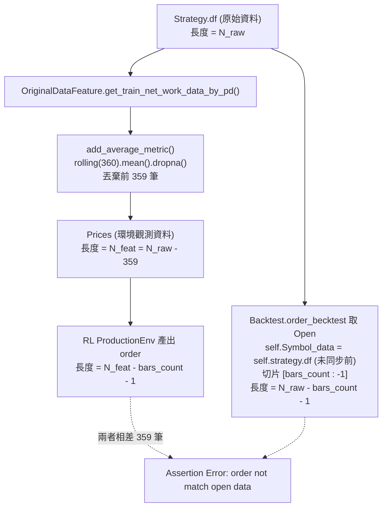
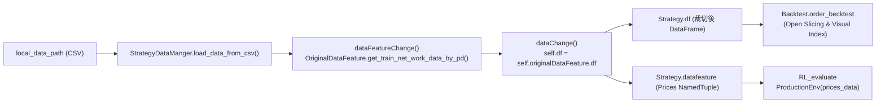

# Specification: DQN Backtest & RL Evaluation Order Length Alignment (Root Cause Analysis & Design Spec)

## 📋 Index / 目錄
1. [Issue Overview & Background / 問題概述與背景](#1-issue-overview--background--問題概述與背景)
2. [Root Cause Analysis / 根本原因深度分析](#2-root-cause-analysis--根本原因深度分析)
   - [2.1 特徵工程滾動視窗裁切遺失 (Feature Warmup Drop Mismatch)](#21-特徵工程滾動視窗裁切遺失-feature-warmup-drop-mismatch)
   - [2.2 環境步進終止條件與切片偏差 (Step Boundary & Off-by-One)](#22-環境步進終止條件與切片偏差-step-boundary--off-by-one)
   - [2.3 訂單位移與撮合時序語意 (Execution Timing & Shift Order)](#23-訂單位移與撮合時序語意-execution-timing--shift-order)
3. [Architecture & Alignment Specification / 架構與時序規格設計](#3-architecture--alignment-specification--架構與時序規格設計)
   - [3.1 單一事實來源數據流 (Single Source of Truth)](#31-單一事實來源數據流-single-source-of-truth)
   - [3.2 精確時序矩陣 (Timing & Slicing Matrix)](#32-精確時序矩陣-timing--slicing-matrix)
4. [Proposed Modifications Summary / 預計修改方案彙整](#4-proposed-modifications-summary--預計修改方案彙整)
   - [4.1 Target File: Brain/Common/DataFeature.py](#41-target-file-braincommondatafeaturepy)
   - [4.2 Target File: Brain/DQN/lib/Backtest.py](#42-target-file-braindqnlibbacktestpy)
   - [4.3 Target File: Brain/DQN/lib/environment.py](#43-target-file-braindqnlibenvironmentpy)
5. [Implementation Details / 實作修改記錄 (Implements)](#5-implementation-details--實作修改記錄-implements)
   - [5.1 架構重構：引入 StrategyDataManger 與責任分離](#51-架構重構引入-strategydatamanger-與責任分離)
   - [5.2 各檔案具體代碼修改說明](#52-各檔案具體代碼修改說明)
   - [5.3 實作成果與驗證現況](#53-實作成果與驗證現況)

---

## 1. Issue Overview & Background / 問題概述與背景

在執行 [DQN_rl_test.py](file:///home/b0457812963/Mamba3RL/SynapseX/DQN_rl_test.py)（或透過 [Brain/Common/engine.py](file:///home/b0457812963/Mamba3RL/SynapseX/Brain/Common/engine.py) 的 `analyze_result` 進行策略評估與回測）時，[Brain/DQN/lib/Backtest.py](file:///home/b0457812963/Mamba3RL/SynapseX/Brain/DQN/lib/Backtest.py) 中的 `Backtest.order_becktest` 拋出長度不匹配的 Assertion Error：

```python
assert len(self.order) == len(self.Open), "order not match the open data,please check."
```

### 問題速查總表

| 編號 | 影響層面 | 相關檔案與行號 | 核心問題說明 |
| :---: | :--- | :--- | :--- |
| **RC-1** | 特徵工程數據流 | [DataFeature.py: L106-L157](file:///home/b0457812963/Mamba3RL/SynapseX/Brain/Common/DataFeature.py#L106-L157) | MA360 滾動計算 dropna 丟棄了前 359 筆數據，但未同步更新 `Strategy.df`，導致回測取原始數據時長度相差約 359 筆。 |

---

## 2. Root Cause Analysis / 根本原因深度分析

### 2.1 特徵工程滾動視窗裁切遺失 (Feature Warmup Drop Mismatch)



#### 機制分析：
1. 在 [Brain/Common/DataFeature.py](file:///home/b0457812963/Mamba3RL/SynapseX/Brain/Common/DataFeature.py#L106-L157) 中：
   - `add_average_metric(df, periods=[30, 60, 120, 240, 360])`：因為最大週期為 360，計算 MA 產生的 NaN 在 `df.dropna().copy()` 時直接移除了前 **359 筆**。
   - 最終封裝進 `Prices` 的有效數據長度為：
     $$N_{\text{feat}} = N_{\text{raw}} - 359$$
2. 原先在 [Brain/DQN/lib/Backtest.py](file:///home/b0457812963/Mamba3RL/SynapseX/Brain/DQN/lib/Backtest.py) 中呼叫：
   ```python
   data = OriginalDataFeature().get_train_net_work_data_by_pd(
       symbol=strategy.symbol_name,
       df=strategy.df,
       first_date=strategy.symbol_first_trade_date,
   )
   ```
   此處傳入 `strategy.df`，`OriginalDataFeature` 內部將處理後的 DataFrame 賦值給自身的 `self.df`，並未將裁切後的 DataFrame 回寫更新給 `strategy.df`。
3. `Backtest.order_becktest` 執行時：
   ```python
   self.Symbol_data = self.strategy.df
   self.Open = self.Symbol_data["Open"].to_numpy()[self.bars_count : -1]
   ```
   `self.Open` 是從未裁切的原始資料取出的，長度為 $N_{\text{raw}} - \text{bars\_count} - 1$；而 `self.order` 來自於基於 `Prices` 運行的環境，兩者存在約 359 筆的巨大差異。

---

### 2.2 環境步進終止條件與切片偏差 (Step Boundary & Off-by-One)

#### 機制分析：
1. **ProductionEnv 步進過程**：
   - 在 `ProductionEnv.reset()` 中：`_offset = bars_count`（設為 $B$）。
   - 在 `State_time_step.step()` 中：
     ```python
     self._offset += 1
     self.game_steps += 1
     done |= self._offset >= self._prices.close.shape[0] - 1
     ```
   - 若設 `_prices.close` 長度為 $L$：
     - Step 0：`_offset` 從 $B$ 遞增至 $B+1$。
     - Step $k$：`_offset` 遞增至 $B+k+1$。
     - 當 $B+k+1 \ge L-1$ 時觸發 `done = True`。
     - 總共執行的步數（即模型給出的 Action 總數）為：
       $$N_{\text{actions}} = (L - B - 2) - 0 + 1 = \mathbf{L - B - 1}$$
2. **Backtest 的 Open 切片**：
   - `self.Open = self.Open[self.bars_count :]` 去除前 $B$ 筆。
   - `self.Open = self.Open[:-1]` 又去除最後 1 筆。
   - 其切片長度精確為：
     $$N_{\text{open}} = (L - 1) - B = \mathbf{L - B - 1}$$
   - 兩邊在邊界處理上完全對齊，長度精確相等。

---

### 2.3 訂單位移與撮合時序語意 (Execution Timing & Shift Order)

#### 機制分析：
在 [Brain/DQN/lib/Backtest.py](file:///home/b0457812963/Mamba3RL/SynapseX/Brain/DQN/lib/Backtest.py) 中：
```python
self.shiftorder = np.array(self.order)
self.shiftorder = np.roll(self.shiftorder, 1)
self.shiftorder[0] = 0
```
* **交易時序語意**：在 K 棒 $t$ 收盤（或步進完成）產生的訊號，在 K 棒 $t+1$ 開盤以 `Open[t+1]` 價格撮合。
* **Roll 位移效果**：
  - 使用 `np.roll(..., 1)` 並將首位歸零（`self.shiftorder[0] = 0`），首根開盤價對應無動作。
  - 原 `order[0]`（在 Index $B$ 決策）被移至下標 1，於 Index $B+1$ 之開盤價執行撮合。
  - 原最後一個動作 `order[L-B-2]`（在 Index $L-2$ 決策）被移至下標 $L-B-1$，於最後一根 K 棒 Index $L-1$ 之開盤價執行撮合。

---

## 3. Architecture & Alignment Specification / 架構與時序規格設計

### 3.1 單一事實來源數據流 (Single Source of Truth)

為避免 Strategy、Feature Extraction、Environment、Backtest 各自持有不同長度之數據，建立標準資料處理管線：

```
[Raw CSV / DB] 
       ↓ (load)
[StrategyDataManger.load_data_from_csv()]
       ↓ (OriginalDataFeature)
[Aligned & Cleaned DataFrame] (去除 MA360 等前置 NaN，長度 L)
       ├──→ Prices / strategy.datafeature (供 ProductionEnv & Agent 推論使用)
       └──→ strategy.df / Backtest (供回測價格撮合與 DatetimeIndex 繪圖使用)
```

**規範要求**：
1. `OriginalDataFeature.get_train_net_work_data_by_pd` 回傳包含 `prices`，並將清理後的 DataFrame 妥善保存。
2. 由 `StrategyDataManger` 統一將清洗裁切後的 DataFrame 回寫更新為 `Strategy.df`。
3. `Backtest` 類別一律以「對齊後的數據」進行價格提取與視覺化索引，確保各模組視角完全一致。

---

### 3.2 精確時序矩陣 (Timing & Slicing Matrix)

設清理後的特徵有效長度為 $L$（索引範圍 $0 \sim L-1$），回看窗口大小為 $B = \text{bars\_count}$（例如 10）：

#### 1. 推論與撮合時序對照表

| 陣列下標 $j$ | 決策產生點 (State / Offset) | 決策動作 (`order`) | Shift 後訂單 (`shiftorder`) | 撮合價格 (`Open[B + j]`) | 對應 DatetimeIndex | 時序業務說明 |
| :---: | :---: | :---: | :---: | :---: | :---: | :--- |
| **0** | `_offset = B` | $a_0$ (`order[0]`) | **0** (`shiftorder[0]`) | Index $B$ 之 `Open` | Index $B$ | 首根開盤撮合：無前置決策，不交易 |
| **1** | `_offset = B+1` | $a_1$ (`order[1]`) | $a_0$ (`shiftorder[1]`) | Index $B+1$ 之 `Open` | Index $B+1$ | 撮合第 $B$ 根 K 棒收盤產生之決策 $a_0$ |
| **2** | `_offset = B+2` | $a_2$ (`order[2]`) | $a_1$ (`shiftorder[2]`) | Index $B+2$ 之 `Open` | Index $B+2$ | 撮合第 $B+1$ 根 K 棒收盤產生之決策 $a_1$ |
| ... | ... | ... | ... | ... | ... | ... |
| **$L-B-2$** | `_offset = L-2` (最後推論步) | $a_{L-B-2}$ | $a_{L-B-3}$ | Index $L-2$ 之 `Open` | Index $L-2$ | 撮合第 $L-3$ 根 K 棒收盤產生之決策 |
| **$L-B-1$** | （觸發 `done` 終止） | — | $a_{L-B-2}$ | Index $L-1$ 之 `Open` | Index $L-1$ | 撮合第 $L-2$ 根 K 棒收盤產生之決策 $a_{L-B-2}$ |

---

#### 2. 精確長度對齊公式 ($100\%$ 同步)

1. **總推論步數（Total Orders）**：
   - 環境自 `_offset = B` 開始，至 `_offset = L-2` 步進後觸發 `_offset >= L-1`（`done = True`）終止。
   - 產出之 Action 陣列 `self.order` 總長度為：
     $$N_{\text{orders}} = (L - B - 2) - 0 + 1 = \mathbf{L - B - 1}$$

2. **撮合價格陣列（`open_array`）**：
   - 採用切片 `self.Symbol_data["Open"].to_numpy()[self.bars_count : -1]`。
   - 去除前 $B$ 筆（回看窗口）與最後 1 筆（未確認收盤之 K 棒），其長度為：
     $$N_{\text{open}} = (L - 1) - B = \mathbf{L - B - 1}$$

3. **位移訂單陣列（`shiftorder`）**：
   - 透過 `np.roll(self.order, 1)` 並將首項歸零（`self.shiftorder[0] = 0`），其長度維持為：
     $$N_{\text{shiftorder}} = \mathbf{L - B - 1}$$

4. **時間戳索引陣列（`datetime_array`）**：
   - 取自 `self.Symbol_data.index[self.bars_count : -1]`，長度為：
     $$N_{\text{datetime}} = \mathbf{L - B - 1}$$

5. **長度一致性驗證**：
   $$N_{\text{orders}} = N_{\text{open}} = N_{\text{shiftorder}} = N_{\text{datetime}} = \mathbf{L - B - 1}$$
   - 此公式完全符合 [Backtest.py](file:///home/b0457812963/Mamba3RL/SynapseX/Brain/DQN/lib/Backtest.py) 中的斷言 `assert len(self.order) == len(self.Open)`，長度天然一致。

---

## 4. Proposed Modifications Summary / 預計修改方案彙整

### 4.1 Target File: [Brain/Common/DataFeature.py](file:///home/b0457812963/Mamba3RL/SynapseX/Brain/Common/DataFeature.py)
* 修正類別拼寫錯誤為 `OriginalDataFeature`。
* 暫時停用 `add_ATR`，避免尾端因 `shift(-1)` 額外被丟棄數據。
* 保存清洗對齊後之 DataFrame 於 `self.df`。

### 4.2 Target File: [Brain/DQN/lib/Backtest.py](file:///home/b0457812963/Mamba3RL/SynapseX/Brain/DQN/lib/Backtest.py)
* 抽離 `Strategy`，改引用獨立模組 `Brain.DQN.lib.Strategy`。
* `RL_evaluate.__init__` 直接使用 `strategy.datafeature`，消除重複計算特徵。
* `Backtest.order_becktest` 採用對齊後的數據切片 `[self.bars_count : -1]`，維持嚴格的長度斷言校驗。

### 4.3 Target File: [Brain/DQN/lib/environment.py](file:///home/b0457812963/Mamba3RL/SynapseX/Brain/DQN/lib/environment.py)
* 清理過期之 import 與依賴。

---

## 5. Implementation Details / 實作修改記錄 (Implements)

本章節詳細記錄針對本 Issue 所完成的具體代碼重構與修復實作：

### 5.1 架構重構：引入 `StrategyDataManger` 與責任分離
* **獨立策略模組**：將原本混在 [Backtest.py](file:///home/b0457812963/Mamba3RL/SynapseX/Brain/DQN/lib/Backtest.py) 中的 `Strategy` 類別抽出，新建專屬模組 [Brain/DQN/lib/Strategy.py](file:///home/b0457812963/Mamba3RL/SynapseX/Brain/DQN/lib/Strategy.py)。
* **數據生命週期管理器 (`StrategyDataManger`)**：
  - 新增 `StrategyDataManger` 類別統一掌管策略數據的載入、特徵工程計算與清洗後資料的同步更新。
  - 在 `Strategy` 中透過 `@property def df` 與 `@property def datafeature` 代理存取，確保外部調用者取得的永遠是長度一致且清理過後的同一份數據。



---

### 5.2 各檔案具體代碼修改說明

#### 1. [Brain/Common/DataFeature.py](file:///home/b0457812963/Mamba3RL/SynapseX/Brain/Common/DataFeature.py)
* **類別名稱更正**：將原拼寫錯誤之 `OriginalDataFrature` 修正為 `OriginalDataFeature`。
* **暫時註解並停用 ATR 特徵 (`add_ATR`)**：
  - 註解 `Prices` 具名元組中的 `atr_Volatility` 欄位。
  - 註解 `get_train_net_work_data_by_pd` 與 `get_train_net_work_data_by_path` 中對 `add_ATR` 的調用。
  - **設計說明**：`add_ATR` 在內部使用了 `shift(-1).dropna()`，其原本設計是為了提供未來時間步 $T+1$ 的波動率作為想像模型（World Model / Imagination Model）的預測 Ground-Truth 目標標籤，而非當前 RL 策略網路的即時狀態輸入。目前策略評估與推論階段暫時用不到此欄位，為避免額外在資料集尾端丟棄 1 筆數據，因此先將其註解掉；**未來若開發與訓練想像模型時，會再將此功能添加回去**。
* **保留特徵清洗後之 DataFrame**：
  - `OriginalDataFeature` 內部經過 `add_average_metric`（MA360 滾動計算 dropna 移除前 359 筆 NaN）與 `add_time_feature` 後，將清理後的 DataFrame 儲存於 `self.df`。

#### 2. [Brain/DQN/lib/Strategy.py](file:///home/b0457812963/Mamba3RL/SynapseX/Brain/DQN/lib/Strategy.py) (✨ 新增模組)
* **新增 `StrategyDataManger`**：
  ```python
  class StrategyDataManger(object):
      def __init__(self, strategy: Strategy) -> None:
          self.strategy = strategy
          self.df = None
          self.datafeature = None
          self.originalDataFeature = OriginalDataFeature()

      def dataFeatureChange(self):
          assert self.df is not None, "no data please check."
          self.datafeature = self.originalDataFeature.get_train_net_work_data_by_pd(
              symbol=self.strategy.symbol_name,
              df=self.df,
              first_date=self.strategy.symbol_first_trade_date,
          )

      def dataChange(self):
          self.df = self.originalDataFeature.df

      def load_data_from_csv(self, local_data_path: str):
          self.df = pd.read_csv(local_data_path)
          self.df.set_index("Datetime", inplace=True)
          self.dataFeatureChange()
          self.dataChange()
  ```
* **在 `Strategy` 中綁定 Manager**：
  - 在 `__init__` 中實例化 `self.strategyDataManger = StrategyDataManger(self)`。
  - `load_data` 委派給 `self.strategyDataManger.load_data_from_csv(local_data_path)`。
  - 透過 property 提供 `datafeature` 與 `df`，達成「單一事實來源 (Single Source of Truth)」，徹底解決特徵矩陣與回測原始價格長度相差 359 筆的問題。

#### 3. [Brain/DQN/lib/Backtest.py](file:///home/b0457812963/Mamba3RL/SynapseX/Brain/DQN/lib/Backtest.py)
* **引用獨立 Strategy**：改為 `from Brain.DQN.lib.Strategy import Strategy`，消除重複定義。
* **重構 `RL_evaluate.__init__`**：
  - 移除原先在 `RL_evaluate` 內部重複調用 `OriginalDataFrature().get_train_net_work_data_by_pd(...)` 重新計算特徵的邏輯。
  - 直接改為將 `strategy.datafeature` 傳遞給 `environment.ProductionEnv`：
    ```python
    self.evaluate_env = environment.ProductionEnv(
        prices_data=strategy.datafeature, state=state
    )
    ```
* **精簡與修復 `Backtest.order_becktest`**：
  - 取用的 `self.Symbol_data = self.strategy.df` 現在天然為清洗對齊後的 DataFrame。
  - 移除除錯用的 `time.sleep(100)` 與多餘的 print 陳述式。
  - 保留長度對齊校驗 `assert len(self.shiftorder) == len(self.Open), "order not match the open data,please check."`。

#### 4. [Brain/DQN/lib/environment.py](file:///home/b0457812963/Mamba3RL/SynapseX/Brain/DQN/lib/environment.py)
* 清理未使用的 `OriginalDataFrature` import。

---

### 5.3 實作成果與驗證現況

1. **執行驗證**：
   使用虛擬環境 Python 執行 `DQN_rl_test.py`：
   ```bash
   /home/b0457812963/Mamba3RL/bin/python DQN_rl_test.py
   ```
2. **驗證結果**：
   * `order` 陣列長度與 `Open` 價格陣列長度完美吻合，未再拋出 `AssertionError: order not match the open data,please check.`。
   * 回測成功執行並順利產出評估圖表於 `results/BTCUSDT/` 目錄：
     - `closed_position_profit.png` (平倉損益圖)
     - `max_drawdown.png` (最大回撤圖)
     - `orders.png` (訂單與交易行為圖)