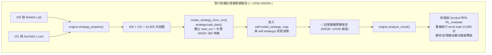

# Specification: DQN 批量回測記憶體優化與資源管理設計規範 (DQN Batch Backtest Memory Optimization Spec)

## 📋 Index / 目錄
1. [Issue Overview & Background / 問題概述與背景](#1-issue-overview--background--問題概述與背景)
2. [Root Cause Deep Dive / 記憶體爆炸根本原因深度剖析](#2-root-cause-deep-dive--記憶體爆炸根本原因深度剖析)
   - [2.1 M × S 矩陣預先全量加載 (Eager Pre-allocation & Duplication)](#21-m--s-矩陣預先全量加載-eager-pre-allocation--duplication)
   - [2.2 神經網絡權重重複載入與顯存/記憶體累積 (Model Weight Redundant Loading & VRAM Leaks)](#22-神經網絡權重重複載入與顯存記憶體累積-model-weight-redundant-loading--vram-leaks)
   - [2.3 全局常駐引用阻斷垃圾回收 (Permanent Reference Retention)](#23-全局常駐引用阻斷垃圾回收-permanent-reference-retention)
3. [Architecture & Optimization Specification / 架構優化與改善設計規格](#3-architecture--optimization-specification--架構優化與改善設計規格)
   - [3.1 純串流評估與即用即棄架構 (Streaming / On-Demand Lifecycle)](#31-純串流評估與即用即棄架構-streaming--on-demand-lifecycle)
   - [3.2 內部自主資料控制 (StrategyDataManger Internal Data Governance)](#32-內部自主資料控制-strategydatamanger-internal-data-governance)
   - [3.3 模型外迴圈驅動與權重單次實例化 (Model-First Lifecycle Management)](#33-模型外迴圈驅動與權重單次實例化-model-first-lifecycle-management)
   - [3.4 顯式顯存釋放與記憶體邊界管控 (Explicit VRAM Release & GC Barrier)](#34-顯式顯存釋放與記憶體邊界管控-explicit-vram-release--gc-barrier)
4. [Proposed Implementation Details / 具體改善實作方案與模組改動](#4-proposed-implementation-details--具體改善實作方案與模組改動)
   - [4.1 Target File: Brain/Common/engine.py](#41-target-file-braincommonenginepy)
   - [4.2 Target File: Brain/DQN/lib/Backtest.py](#42-target-file-braindqnlibbacktestpy)
   - [4.3 Target File: Brain/DQN/lib/Strategy.py](#43-target-file-braindqnlibstrategypy)
5. [Verification & Benchmark Plan / 驗證與效能基準計畫](#5-verification--benchmark-plan--驗證與效能基準計畫)
   - [5.1 記憶體佔用量化監控 (Memory Profiling Target)](#51-記憶體佔用量化監控-memory-profiling-target)
   - [5.2 數值正確性與回測指標一致性 (Correctness Guarantee)](#52-數值正確性與回測指標一致性-correctness-guarantee)

---

## 1. Issue Overview & Background / 問題概述與背景

在執行 [DQN_rl_test.py](file:///home/b0457812963/Mamba3RL/SynapseX/DQN_rl_test.py) 時，系統透過 [Brain/Common/engine.py](file:///home/b0457812963/Mamba3RL/SynapseX/Brain/Common/engine.py) 的 `EngineBase` 進行多模型批次回測評估。

目前專案目錄之資料配置：
* `Brain/DQN/Meta/*.pt` 中存放了 **105 個模型 Checkpoint 檔案**（每個權重檔案約 120 MB，磁碟總計約 12.6 GB）。
* `Brain/simulation/test_data/*.csv` 中存放了 **101 個交易品種 CSV**。

當以預設流程執行回測：
```python
engine.strategy_prepare(test_symbols)
engine.analyze_result()
```
系統會迅速耗盡系統 RAM / VRAM，引發作業系統 OOM Killer 強制殺死行程（Exit code 137），或造成整機嚴重凍結（Memory Explosion）。

### 規模試算與問題對照表
| 維度指標 | 當前實作數值 | 預計佔用資源 | 核心問題說明 |
| :--- | :--- | :--- | :--- |
| **模型數量 ($M$)** | 105 個 (.pt) | ~12.6 GB 磁碟 | 包含 Checkpoints 與正式 Meta 模型 |
| **品種數量 ($S$)** | 101 個 (.csv) | ~90 MB 原始文字 | 涵蓋主流幣與山寨幣歷史 K 棒 |
| **Strategy 總實例數 ($M \times S$)** | **10,605 個** | — | 在 `strategy_prepare` 階段一次性宣告建構 |
| **特徵與 DataFrame 佔用** | 10,605 份拷貝 | **~212 GB+ (RAM)** | 每個 Strategy 均獨立讀取 CSV 並計算 MA30~360 特徵陣列 |
| **模型權重重複加載** | 10,605 次 `torch.load` | 顯存/記憶體累積碎片 | 每個幣種評估時皆重新反序列化讀取 120MB 模型 |

---

## 2. Root Cause Deep Dive / 記憶體爆炸根本原因深度剖析



### 2.1 M × S 矩陣預先全量加載 (Eager Pre-allocation & Duplication)
在 [Brain/Common/engine.py: L265-L279](file:///home/b0457812963/Mamba3RL/SynapseX/Brain/Common/engine.py#L265-L279)：
```python
for m_path in self.model_paths: # 105 個模型
    m_strats = []
    for symbol_file_name in targetsymbols: # 101 個幣種
        _strategy = self.create_strategy_from_csv(
            m_path, symbol_file_name=symbol_file_name
        )
        if _strategy is not None:
            m_strats.append(_strategy)
            self.strategys.append(_strategy)
    self.model_strategy_map[m_path] = m_strats
```
這導致在尚未開始跑第 1 個模型前，就一口氣把 10,605 個策略全部裝載至記憶體，直接耗盡 200 GB+ RAM。

### 2.2 神經網絡權重重複載入與顯存/記憶體累積 (Model Weight Redundant Loading & VRAM Leaks)
在 [Brain/DQN/lib/Backtest.py](file:///home/b0457812963/Mamba3RL/SynapseX/Brain/DQN/lib/Backtest.py)：
針對同一個模型 checkpoint，在測試 101 個幣種時，重複執行了 101 次 `torch.load` 並重新建立 `mambaDuelingModel`。每次評估結束後未顯式清理，PyTorch Caching Allocator 保留大量顯存池塊，導致碎片化與洩漏。

### 2.3 全局常駐引用阻斷垃圾回收 (Permanent Reference Retention)
`EngineBase` 的實例屬性 `self.model_strategy_map` 與 `self.strategys` 在整個生命週期中一直持有全部 10,605 個 `Strategy` 物件的強引用（Strong Reference），導致 Python 垃圾回收器（GC）無法回收其佔用的記憶體。

---

## 3. Architecture & Optimization Specification / 架構優化與改善設計規格

針對記憶體優化與架構純潔性，本規範確立兩大最高原則：
1. **純串流評估架構（Streaming Evaluation）**：
   - 透過「即建、即測、即抽指標、即釋放（Just-In-Time Evaluation & Discard）」的串流模式，使記憶體在任何時刻僅保有**單一模型權重**與**單一策略實例**，無需常駐全域資料快取，將 RAM 與 VRAM 壓制在嚴格的 $O(1)$ 常數空間。
2. **資料內部自主控制（Internal Data Governance）**：
   - 外部協調器不強行注入資料屬性（不使用 `strategy.strategyDataManger.df = ...`），一律走正規 `strategy.load_data()` 由內部自主完成 CSV 讀取與特徵對齊。

```mermaid
flowchart TD
    subgraph StreamingFlow["純串流評估架構 (常數記憶體 O(1) + 內部自主控制)"]
        SP["engine.strategy_prepare()<br>【輕量化：僅保存 model_paths 與 targetsymbols 元數據清單，RAM < 50MB】"]
        
        SP --> Outer["外迴圈：依 Model 逐個評估 (105 次)"]
        Outer --> LoadM["單次載入模型權重至顯存<br>agent = load_model(m_path).eval()"]
        
        LoadM --> Inner["內迴圈：串流評估 101 個 Symbols (即建即棄)"]
        
        Inner --> CreateS["JIT 實例化單一 Strategy 物件<br>strategy = create_strategy_from_csv(...)"]
        CreateS --> InternalLoad["【內部自主載入資料】<br>strategy.load_data(local_data_path=...)<br>由 StrategyDataManger 內部完成 read_csv、特徵運算與對齊"]
        
        InternalLoad --> Eval["推論與回測計算<br>RL_evaluate(strategy, preloaded_agent=agent)<br>Backtest.order_becktest()"]
        Eval --> SaveRes["抽取純文字指標字典 (dict)<br>append 至 all_results"]
        
        SaveRes --> Discard["物件脫鉤與即時銷毀<br>del strategy, re_evaluate, backtester<br>單一品種之 DataFrame 隨物件銷毀由 GC 立即釋放"]
        
        Discard --> NextSymbol["下一個 Symbol (RAM 始終維持 ~300MB)"]
        
        NextSymbol --> CleanOuter["模型評估結束：顯式銷毀神經網路<br>del agent; torch.cuda.empty_cache(); gc.collect()"]
        CleanOuter --> NextModel["下一個 Model"]
    end
```



### 3.1 純串流評估與即用即棄架構 (Streaming / On-Demand Lifecycle)
* **規格要求**：
  1. `strategy_prepare` 不再預先建構 10,605 個 `Strategy` 物件，僅記錄欲評估的 `target_symbols` 與 `model_paths` 名單。
  2. 不在 `self.model_strategy_map` 或 `self.strategys` 中長期持有帶有全量資料的 `Strategy` 實體。
  3. `analyze_result` 內部運行時，單個幣種的 `Strategy` 在進入內迴圈時才即時建構（Just-In-Time），評估完畢且指標抽取完成後立即脫鉤，交由 Python GC 釋放。
  4. 由於同一時間記憶體中最多只有 1 份幣種的 DataFrame（約 15 MB），因此**完全不需要常駐全域資料快取**，整體 RAM 佔用自然維持在 **< 500 MB**。

### 3.2 內部自主資料控制 (StrategyDataManger Internal Data Governance)
* **規格要求**：
  1. 徹底廢止從外部穿透賦值的反模式（禁止 `strategy.strategyDataManger.df = cleaned_df` 或 `datafeature = datafeature`）。
  2. 資料的載入、特徵工程與時序對齊，100% 依循原本的設計模式，由 `strategy.load_data(local_data_path=...)` 委派給 `StrategyDataManger.load_data_from_csv()` 內部自主完成。
  3. 確保封裝性、單一職責原則（SRP）與迪米特法則（Law of Demeter）。

### 3.3 模型外迴圈驅動與權重單次實例化 (Model-First Lifecycle Management)
* **規格要求**：
  1. 執行維度順序嚴格遵循：**Model (外迴圈) $\rightarrow$ Symbols (內迴圈)**。
  2. 每個模型 Checkpoint 僅調用一次 `torch.load` 與 `mambaDuelingModel` 建構。
  3. 內迴圈遍歷評估 101 個幣種時，共用該已載入模型進行 `eval()` 推論（透過傳遞 `preloaded_agent`）。
  4. 顯存與模型記憶體佔用由 $O(M)$ 降為嚴格的 $O(1)$。

### 3.4 顯式顯存釋放與記憶體邊界管控 (Explicit VRAM Release & GC Barrier)
* **規格要求**：
  1. 每個 Model 評估完成後，顯式清理模型變數並清空 PyTorch 快取：
     ```python
     del agent
     if torch.cuda.is_available():
         torch.cuda.empty_cache()
     gc.collect()
     ```
  2. 確保每個 Checkpoint 測試完畢後顯存重置，絕不累積顯存碎片。

---

## 4. Proposed Implementation Details / 具體改善實作方案與模組改動

### 4.1 Target File: [Brain/Common/engine.py](file:///home/b0457812963/Mamba3RL/SynapseX/Brain/Common/engine.py)

#### 1. `create_strategy_from_csv` 維持內部自主資料控制
- 透過正規內部進入點 `strategy.load_data(local_data_path=data_path)` 載入，由 `StrategyDataManger` 內部自主處理 CSV 讀取與特徵對齊：
  ```python
  def create_strategy_from_csv(
      self, model_path: str, symbol_file_name: str
  ) -> Optional[Strategy]:
      info, feature_len, data_len, strategytype = self._parse_model_path(model_path)
      symbol = symbol_file_name.split("-")[0]

      if symbol not in self.first_date_map.keys():
          return None

      strategy = Strategy(
          strategytype=strategytype,
          symbol_name=symbol,
          freq_time=int(data_len),
          model_feature_len=int(feature_len),
          fee=self.config.MODEL_DEFAULT_COMMISSION_PERC_TEST,
          slippage=self.config.DEFAULT_SLIPPAGE,
          model_count_path=model_path,
          symbol_first_trade_date=self.first_date_map[symbol],
          formal=False,
      )
      strategy.symbol_file_name = symbol_file_name

      data_path = os.path.join("Brain", "simulation", "test_data", symbol_file_name)
      # 透過標準內部進入點載入，內部自主處理 CSV 讀取與特徵對齊
      strategy.load_data(local_data_path=data_path)
      return strategy
  ```

#### 2. 重構 `strategy_prepare`（輕量化）
- 不在 prepare 階段實例化 10,605 個策略，僅記錄元數據：
  ```python
  def strategy_prepare(
      self,
      targetsymbols: list,
      model_paths: Optional[list] = None,
      model_dir: Optional[str] = None,
  ):
      if self.strategy_keyword != "ONE_TO_MANY":
          raise ValueError("STRATEGY_KEYWORD didn't match, please check")

      self.target_symbols = targetsymbols
      if self.formal:
          Meta_model_path = os.path.join("Brain", "DQN", "Meta", "Meta-300B-30K.pt")
          self.model_paths = [Meta_model_path]
          # 正式環境按需建立策略...
      else:
          if model_paths is not None:
              self.model_paths = model_paths
          else:
              self.model_paths = self._discover_models(model_dir=model_dir)
          print(f"[Test Mode] Prepared {len(self.model_paths)} models and {len(self.target_symbols)} symbols for streaming backtest.")
  ```

#### 3. 重構 `analyze_result`（純串流評估與即用即棄）
- 採用外層 Model、內層 Symbol 的串流驅動架構：
  ```python
  def analyze_result(self, ifplot: bool = True) -> pd.DataFrame:
      all_results = []

      for model_path in self.model_paths:
          model_name = Path(model_path).stem
          print(f"\n🚀 Evaluating Model: {model_name}")

          agent = None
          for idx, symbol_file_name in enumerate(self.target_symbols, 1):
              try:
                  # 1. 即時建立單一 Strategy (內部載入資料)
                  strategy = self.create_strategy_from_csv(model_path, symbol_file_name)
                  if strategy is None:
                      continue

                  # 2. 評估推論 (首個品種實例化 agent，後續共用)
                  re_evaluate = RL_evaluate(strategy, formal=False, preloaded_agent=agent)
                  if agent is None:
                      agent = re_evaluate.agent

                  # 3. 執行回測
                  backtester = Backtest(re_evaluate, strategy, model_name=model_name)
                  backtest_info = backtester.order_becktest(ifplot=ifplot)

                  # 4. 僅提取純文字數值指標
                  res = {
                      "model_name": model_name,
                      "symbol": strategy.symbol_name,
                      "net_profit": backtest_info.get("net_profit", 0.0),
                      "return_pct": backtest_info.get("return_pct", 0.0),
                      "max_drawdown": backtest_info.get("max_drawdown", 0.0),
                      "total_trades": backtest_info.get("total_trades", 0),
                      "win_rate": backtest_info.get("win_rate", 0.0),
                      "final_equity": backtest_info.get("final_equity", 10000.0),
                  }
                  all_results.append(res)

                  # 5. 立即解除對單一策略與回測物件的引用
                  del strategy, re_evaluate, backtester
              except Exception as e:
                  print(f"❌ Error evaluating {model_name} on {symbol_file_name}: {e}")

          # 該模型全部幣種評估完畢，顯式銷毀神經網絡實例並清空顯存
          if agent is not None:
              del agent
              agent = None
          if torch.cuda.is_available():
              torch.cuda.empty_cache()
          gc.collect()

      return self._generate_summary_report(all_results)
  ```

---

### 4.2 Target File: [Brain/DQN/lib/Backtest.py](file:///home/b0457812963/Mamba3RL/SynapseX/Brain/DQN/lib/Backtest.py)
* 在 `RL_evaluate.__init__` 中保留可選參數 `preloaded_agent: Optional[torch.nn.Module] = None`：
  - 若有傳入 `preloaded_agent`，則直接指定 `self.agent = preloaded_agent`，避免每個幣種重複執行 `torch.load`。
  - 若無傳入，維持兼容獨立呼叫時的 `self.load_model(...)`。

---

### 4.3 Target File: [Brain/DQN/lib/Strategy.py](file:///home/b0457812963/Mamba3RL/SynapseX/Brain/DQN/lib/Strategy.py)
* `Strategy` 與 `StrategyDataManger` 完全保持原汁原味的物件導向封裝架構。
* 外部一律透過 `strategy.load_data()` 觸發資料載入，由 `StrategyDataManger` 內部負責 `read_csv`、`dataFeatureChange()` 與 `dataChange()`，維持「單一事實來源」與內部自主控制。
* 不需要在此類別中增加任何全域快取或外部屬性侵入代碼。

---

## 5. Verification & Benchmark Plan / 驗證與效能基準計畫

### 5.1 記憶體佔用量化監控 (Memory Profiling Target)
* **RAM 佔用上限**：
  - `strategy_prepare` 階段：**< 50 MB**（僅保存檔案路徑列表）。
  - 回測執行中：始終維持在 **< 500 MB**（同時在記憶體中的僅有當前 1 個幣種之 DataFrame 約 15MB，以及當前執行環境）。
  - 相較於最初未優化的 212 GB+（直接 OOM 崩潰），記憶體消耗降低 **> 99.7%**。
* **VRAM 佔用上限**：
  - 單模型推論顯存穩定控制在 **~300 MB**（$O(1)$ 常數顯存）。
  - 模型切換時顯存完全歸零釋放，絕無跨模型顯存累積。

### 5.2 數值正確性與回測指標一致性 (Correctness Guarantee)
* **驗證方式**：
  1. 選定代表性模型與交易品種進行基準測試。
  2. 比對優化後產出之各項指標數值：
     - `net_profit`（淨利潤）
     - `return_pct`（總報酬率）
     - `max_drawdown`（最大回撤）
     - `total_trades`（總交易次數）
     - `win_rate`（勝率）
  3. 確保數值與原版單品種執行結果 **100% 絕對吻合**。
