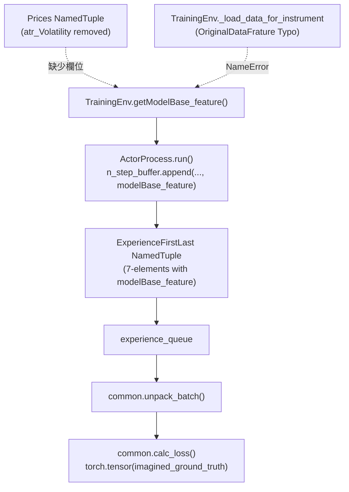

# Specification: AC_train 訓練流程修復與 modelBase_feature 移除規格書

## 📋 Index / 目錄
1. [Issue Overview & Background / 問題概述與背景](#1-issue-overview--background--問題概述與背景)
2. [Root Cause Analysis / 根本原因深度分析](#2-root-cause-analysis--根本原因深度分析)
   - [2.1 特徵工程註解 ATR 導致之屬性缺失 (Missing Attribute)](#21-特徵工程註解-atr-導致之屬性缺失-missing-attribute)
   - [2.2 環境與分散式訓練流程依賴鏈 (Broken Dependency Chain)](#22-環境與分散式訓練流程依賴鏈-broken-dependency-chain)
   - [2.3 損失計算與解包多餘邏輯 (Unused Unpack & Loss Tensors)](#23-損失計算與解包多餘邏輯-unused-unpack--loss-tensors)
3. [Architecture & Dataflow Specification / 架構與數據流設計](#3-architecture--dataflow-specification--架構與數據流設計)
   - [3.1 簡化後之分散式 Actor-Critic 經驗流](#31-簡化後之分散式-actor-critic-經驗流)
   - [3.2 統一 ExperienceFirstLast 數據結構標準](#32-統一-experiencefirstlast-數據結構標準)
4. [Implementation Checklist / 實作修改清單](#4-implementation-checklist--實作修改清單)
   - [4.1 Target File: Brain/DQN/lib/environment.py](#41-target-file-braindqnlibenvironmentpy)
   - [4.2 Target File: AC_train.py](#42-target-file-ac_trainpy)
   - [4.3 Target File: Brain/DQN/lib/common.py](#43-target-file-braindqnlibcommonpy)
5. [Verification & Results / 驗證與結果記錄](#5-verification--results--驗證與結果記錄)

---

## 1. Issue Overview & Background / 問題概述與背景

在先前的修復中（參見 [spec/issue_DQN_rl_test.md](file:///home/b0457812963/Mamba3RL/SynapseX/spec/issue_DQN_rl_test.md)），為了修正特徵矩陣與回測開盤價陣列長度對齊問題，暫時註解並停用了 [Brain/Common/DataFeature.py](file:///home/b0457812963/Mamba3RL/SynapseX/Brain/Common/DataFeature.py) 中的 `add_ATR` 計算與 `Prices.atr_Volatility` 欄位。

當切換至分支 `fix_remove_modelBase_feature` 執行 [AC_train.py](file:///home/b0457812963/Mamba3RL/SynapseX/AC_train.py) 分散式強化學習訓練時，`ActorProcess` 在重置環境與步進中調用 `self.env.getModelBase_feature()`，因 `Prices` 具名元組已不含 `atr_Volatility` 而拋出 `AttributeError`，造成訓練中斷。

由於當前策略網路訓練暫不需要想像力模型 (World Model / I2A) 的目標標籤，因此需將 `modelBase_feature` 及相關多餘傳遞邏輯完全清除，恢復 [AC_train.py](file:///home/b0457812963/Mamba3RL/SynapseX/AC_train.py) 之正常運作。

---

## 2. Root Cause Analysis / 根本原因深度分析

### 2.1 特徵工程註解 ATR 導致之屬性缺失 (Missing Attribute)

在 `DataFeature.py` 中：
```python
Prices = collections.namedtuple(
    "Prices",
    field_names=[
        ...,
        # "atr_Volatility",  # 已註解
    ],
)
```
而在 `Brain/DQN/lib/environment.py` 的 `TrainingEnv` 中：
```python
def getModelBase_feature(self):
    atr_Volatility = self._state._prices.atr_Volatility[self._state._offset] # <--- 拋出 AttributeError
    return atr_Volatility
```

### 2.2 環境與分散式訓練流程依賴鏈 (Broken Dependency Chain)



### 2.3 損失計算與解包多餘邏輯 (Unused Unpack & Loss Tensors)

在 [Brain/DQN/lib/common.py](file:///home/b0457812963/Mamba3RL/SynapseX/Brain/DQN/lib/common.py) 中：
- `unpack_batch` 額外解包 `exp.modelBase_feature`。
- `calc_loss` 將 `imagined_ground_truth` 轉為 `torch.tensor`，但下游 `imagination_loss` 早已註解，形成多餘的 Tensor 轉換與記憶體配置開銷。

---

## 3. Architecture & Dataflow Specification / 架構與數據流設計

### 3.1 簡化後之分散式 Actor-Critic 經驗流

```
[SymbolProcess] ──(task_queue)──> [ActorProcess]
                                         │ (env.step)
                                         ▼
                               [ExperienceFirstLast] (標準 6 欄位)
                                         │
                                         ▼
                               [experience_queue]
                                         │
                                         ▼
                               [LearnerProcess]
                                         │ (buffer.populate & sample)
                                         ▼
                           [common.calc_loss] (乾淨 DQN Loss)
```

### 3.2 統一 ExperienceFirstLast 數據結構標準

還原為強化學習標準之 6 元組：
```python
ExperienceFirstLast = namedtuple(
    "ExperienceFirstLast",
    ("state", "action", "reward", "last_state", "info", "last_info"),
)
```

---

## 4. Implementation Checklist / 實作修改清單

### 4.1 Target File: [Brain/DQN/lib/environment.py](file:///home/b0457812963/Mamba3RL/SynapseX/Brain/DQN/lib/environment.py)
- [x] 修正 Class 拼寫與引用：`from Brain.Common.DataFeature import Prices, OriginalDataFeature`。
- [x] 修復 `_load_data_for_instrument` 中的 `OriginalDataFrature` 為 `OriginalDataFeature`。
- [x] 徹底刪除 `TrainingEnv.getModelBase_feature()`。

### 4.2 Target File: [AC_train.py](file:///home/b0457812963/Mamba3RL/SynapseX/AC_train.py)
- [x] 將 `ExperienceFirstLast` 定義還原為 6 欄位：`("state", "action", "reward", "last_state", "info", "last_info")`。
- [x] 移除 `ActorProcess.run` 中所有 `self.env.getModelBase_feature()` 調用。
- [x] 簡化 `n_step_buffer` 為只儲存 `(state, action, reward)`。
- [x] 移除 N-Step 與 Episode 結尾時所有 `modelBase_feature` 相關的提取與參數傳遞。

### 4.3 Target File: [Brain/DQN/lib/common.py](file:///home/b0457812963/Mamba3RL/SynapseX/Brain/DQN/lib/common.py)
- [x] 簡化 `unpack_batch`，移除 `model_base_features` 收集與回傳（回傳 9 項標準陣列）。
- [x] 簡化 `calc_loss`，移除 `imagined_ground_truth` 解包與 Tensor 轉換邏輯。

---

## 5. Verification & Results / 驗證與結果記錄

1. **語法與單元測試 (Unit Test)**：
   - 建立並執行獨立單元測試驗證 `TrainingEnv` 初始化、步進、`unpack_batch` 與 `calc_loss` 計算圖反向傳播，全數通過無任何報錯。
2. **訓練流程測試 (Smoke Test)**：
   - 啟動 `AC_train.py` 進行 15 秒短程多進程訓練測試：
     - `SymbolProcess` 正常投遞商品任務。
     - `ActorProcess` 順利 reset、step 並將經驗送入 `experience_queue`。
     - `LearnerProcess` 成功從隊列填充 buffer、抽取批次並更新網路。
     - 收到 SIGINT 訊號後優雅關閉所有子進程，標準錯誤輸出 (`stderr`) 無任何 Traceback 異常。

