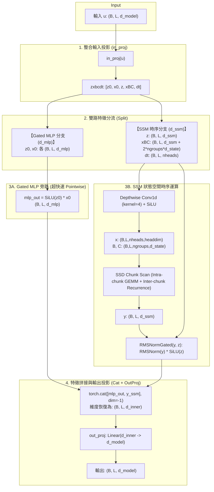

# Mamba2 (SSD) 模型結構解析與 SynapseX 遷移學習規範

## 📋 目錄 (Index)
1. [引言與學習目標](#1-引言與學習目標)
2. [Mamba1 vs Mamba2 核心演化與數學原理 (SSD)](#2-mamba1-vs-mamba2-核心演化與數學原理-ssd)
3. [mamba2.py 原始碼深度結構剖析](#3-mamba2py-原始碼深度結構剖析)
4. [特殊混合模式：SSM + Gated MLP 並聯機制 (d_ssm 參數)](#4-特殊混合模式ssm--gated-mlp-並聯機制-d_ssm-參數)
5. [Mamba2 張量數據流與計算圖 (Tensor Flow)](#5-mamba2-張量數據流與計算圖-tensor-flow)
6. [SynapseX 專案適配與參數調優指南 (Financial RL)](#6-synapsex-專案適配與參數調優指南-financial-rl)
7. [常見陷阱、約束與遷移檢查清單 (Checklist)](#7-常見陷阱約束與遷移檢查清單-checklist)

---

## 1. 引言與學習目標

在量化交易與金融時序強化學習專案 **[SynapseX](file:///home/b0457812963/Mamba3RL/SynapseX)** 中，模型的核心任務是捕捉歷史行情（如 300 根 K 線的價格波動與時間特徵）的長程時序依賴，並藉由 Policy / Value 網路做出決策。

原專案採用 **Mamba-1 (Selective State Space Model)** 作為時序特徵混合器（Mixer）。為了進一步提升模型表徵容量（State Capacity）、數值穩定性（Numerical Stability）以及並行運算效率，本規範針對 Mamba2 核心原始碼：
- [mamba2.py](file:///home/b0457812963/Mamba3RL/lib/python3.12/site-packages/mamba_ssm/modules/mamba2.py)

進行深入拆解與架構剖析，並提供整合至 [Brain/Common/ssm_tool.py](file:///home/b0457812963/Mamba3RL/SynapseX/Brain/Common/ssm_tool.py) 的具體遷移依據。

---

## 2. Mamba1 vs Mamba2 核心演化與數學原理 (SSD)

### 2.1 為什麼需要 Mamba2？（演進動力）
* **Mamba1 的瓶頸**：
  1. **硬體計算密集度低 (Low Arithmetic Intensity)**：Mamba1 依賴自定義的 Triton/CUDA Sequential Scan，在 GPU 上主要是 Memory-bound（記憶體頻寬受限），無法有效利用 GPU 上最強大的 **Tensor Cores (GEMM 矩陣乘法加速單元)**。
  2. **狀態維度受限**：Mamba1 的隱狀態維度 $d_{state}$ 通常只能設在 16（若設 64 或 128 會嚴重拖慢訓練速度）。
  3. **分散投影與通訊開銷**：$B, C, \Delta t$ 採用獨立投影層，無法直接做大規模張量並行（Tensor Parallelism）。

* **Mamba2 的核心突破：SSD (Structured State Space Duality)**：
  - **狀態空間二象性 (Duality)**：論文證明了「特定結構的選擇性狀態空間模型（1-SSM）」在數學上等價於「帶有特定因果遮罩的線性注意力機制（Linear Attention with Causal Mask）」。
  - **塊狀並行 (Chunk Scan)**：將長度為 $L$ 的時序切分為多個 Chunk（大小為 $Q$，如 64 或 256）。
    - **塊內 (Intra-chunk)**：轉化為矩陣乘法 $Q \times K^\top \times V$ 結構，**完全跑在 Tensor Cores 上**。
    - **塊間 (Inter-chunk)**：採用純線性遞推（Linear Recurrence）傳遞隱狀態 $h_t$。
  - **狀態維度擴張**：$d_{state}$ 可輕鬆放大至 **64 或 128**（甚至 256），使模型能記憶更多微觀價格微動態與宏觀波動體制（Regime）。

### 2.2 核心特性對比表

| 特性 / 維度 | Mamba1 (`Mamba`) | Mamba2 (`Mamba2`) | 金融 RL (SynapseX) 的效益 |
| :--- | :--- | :--- | :--- |
| **計算典範** | 純選擇性循序掃描 (Selective Scan) | **SSD 塊狀掃描 (Chunk Scan / GEMM)** | 訓練吞吐量大幅提高，收斂更快 |
| **狀態維度 $d_{state}$** | 通常為 $16$ | **預設 $64$ 或 $128$** | 記憶容量提升 4~8 倍，可捕捉更長期的震盪與趨勢 |
| **多頭機制 (Heads)** | 單頭 / 維度獨立通道 | **Multi-Head SSD + Grouped $B,C$ (GQA)** | 類似 Transformer GQA，大幅減少參數量與防止過擬合 |
| **投影機制** | 分開投影 ($x, z$ 一組，$\Delta t, B, C$ 另一組) | **單一整合投影 `in_proj`** (`z, x, B, C, dt`) | 提高運算融合度，支援 Tensor Parallelism |
| **正規化與門控** | 輸出後直接與 SiLU($z$) 點乘 | **`RMSNormGated` 內部融合規範化** | 極大幅度提升深層 RL 梯度穩定性，避免梯度爆炸 |
| **矩陣 $A$ 結構** | 每個通道獨立對角矩陣 $(D, N)$ | **每個 Head 一個純量衰減參數 $(H,)$** | 簡化計算且更易於穩定約束時間衰減率 |

---

## 3. mamba2.py 原始碼深度結構剖析

### 3.1 `__init__` 初始化核心參數解析

在 [mamba2.py: L37-L197](file:///home/b0457812963/Mamba3RL/lib/python3.12/site-packages/mamba_ssm/modules/mamba2.py#L37-L197) 中，核心架構由以下維度關係決定：

```python
# 1. 內部特徵維度 (d_inner)
self.d_inner = (self.expand * self.d_model) // self.world_size

# 2. SSM 運算維度 (d_ssm)
self.d_ssm = self.d_inner if d_ssm is None else d_ssm // self.world_size

# 3. 頭數 (nheads) 與 每個頭的維度 (headdim，預設 64)
assert self.d_ssm % self.headdim == 0
self.nheads = self.d_ssm // self.headdim

# 4. 分組數 (ngroups) - 類似 GQA (Grouped Query Attention)
self.ngroups = ngroups // self.world_size

# 5. 單一整合輸入投影總維度 (d_in_proj)
# 組成: [z, x, B, C, dt]
#   - 2 * self.d_inner: z 與 x (若有 d_mlp 則包含 z0, x0)
#   - 2 * self.ngroups * self.d_state: B 與 C 矩陣特徵
#   - self.nheads: 每個 head 的 dt 純量
d_in_proj = 2 * self.d_inner + 2 * self.ngroups * self.d_state + self.nheads
self.in_proj = nn.Linear(self.d_model, d_in_proj, bias=bias)
```

### 3.2 內部關鍵子模組功能

1. **整合輸入線性層 (`self.in_proj`)**：
   - 將輸入 $u \in \mathbb{R}^{B \times L \times D}$ 一次性對映為 `zxbcdt`。
   - 避免了 Mamba1 中多次呼叫小矩陣乘法的 kernel launch 開銷。

2. **因果卷積層 (`self.conv1d`)**：
   - 作用維度：`conv_dim = self.d_ssm + 2 * self.ngroups * self.d_state`。
   - 同時對 $X, B, C$ 進行局部 1D Depthwise 因果卷積（預設 `d_conv=4`），為時序特徵注入局部長度為 4 的局部平滑與連續性資訊。

3. **時間常數 $\Delta t$ 與衰減率 $A$**：
   - `self.dt_bias`：以 Inverse Softplus 初始化，確保 $\Delta t$ 在合理的離散化區間 $(\text{dt\_min}, \text{dt\_max})$。
   - `self.A_log`：初始化為 `(nheads,)`，在前向傳播中轉化為 $A = -\exp(A_{\text{log}})$。每個 Head 具備獨立的連續時間衰減率。

4. **跳躍連接 parameter $D$ (`self.D`)**：
   - 類似 ResNet 的直接通路或 SSM 的 $D \cdot x$ 饋通項（Feedthrough）。

5. **門控 RMSNorm (`self.norm = RMSNormGated`)**：
   - [mamba2.py: L187-L189](file:///home/b0457812963/Mamba3RL/lib/python3.12/site-packages/mamba_ssm/modules/mamba2.py#L187-L189)：
   - 對 SSM 的輸出 $y$ 進行 Grouped RMSNorm，並同時與門控信號 $z$（經由 SiLU 激活）進行元素相乘：
     $$\text{Output} = \text{RMSNorm}(y) \odot \text{SiLU}(z)$$

6. **輸出投影層 (`self.out_proj`)**：
   - 將維度 `d_inner` 投射回 `d_model`。

---

---

## 4. 特殊混合模式：SSM + Gated MLP 並聯機制 (`d_ssm` 參數)

在 [mamba2.py: L46](file:///home/b0457812963/Mamba3RL/lib/python3.12/site-packages/mamba_ssm/modules/mamba2.py#L46) 中，建構函式提供了一個非常特殊的參數：
```python
d_ssm=None,  # If not None, we only apply SSM on this many dimensions, the rest uses gated MLP
```

### 4.1 工作原理與代碼拆解

當 `d_ssm` 未指定（預設為 `None`）時，`self.d_ssm = self.d_inner`，所有維度都走 SSM 狀態空間運算。

當指定 `d_ssm < self.d_inner` 時，Mamba2 會將擴展後的內部維度 `d_inner` 分割為兩條並聯分支：
1. **SSM 時序分支**：維度為 `d_ssm`。
2. **Gated MLP 特徵分支**：維度為 `d_mlp = self.d_inner - self.d_ssm`。

在 [mamba2.py: L275-L339](file:///home/b0457812963/Mamba3RL/lib/python3.12/site-packages/mamba_ssm/modules/mamba2.py#L275-L339) 的前向傳播中：
```python
# 1. 計算 Gated MLP 旁路維度
d_mlp = (zxbcdt.shape[-1] - 2 * self.d_ssm - 2 * self.ngroups * self.d_state - self.nheads) // 2

# 2. 將 in_proj 輸出的特徵張量直接切分為 5 份
#    z0, x0 屬於 Gated MLP 分支；z, xBC, dt 屬於 SSM 分支
z0, x0, z, xBC, dt = torch.split(
    zxbcdt,
    [d_mlp, d_mlp, self.d_ssm, self.d_ssm + 2 * self.ngroups * self.d_state, self.nheads],
    dim=-1
)

# 3. xBC, dt, z 進入 Conv1d -> SSD Chunk Scan -> RMSNormGated 得到 y (SSM 輸出)
...

# 4. Gated MLP 分支計算：直接做 SiLU 門控激活，完全不經過 SSM 掃描
if d_mlp > 0:
    mlp_out = F.silu(z0) * x0
    # 5. 將 Gated MLP 輸出與 SSM 輸出在特徵維度拼接
    y = torch.cat([mlp_out, y], dim=-1)

# 6. 最後一起通過 out_proj 投影回 d_model
out = self.out_proj(y)
```

### 4.2 為什麼這種模式可以顯著「加快訓練速度」？

1. **大幅削減時序算子與狀態掃描開銷 (Reduced Sequential/Chunk Scan)**：
   - 1D 因果卷積 (`Conv1d`) 與 SSD Chunk Scan (`mamba_chunk_scan_combined`) 的計算量和顯存佔用直接取決於 `d_ssm`。
   - 若將一半維度劃分給 MLP（例如 $d_{\text{inner}}=256, d_{\text{ssm}}=128$），SSM 的 Head 數直接減半，Triton Kernel 執行的狀態運算量直接減半！
2. **極致的 GPU 硬體利用率 (Tensor Core Dominant)**：
   - Gated MLP 分支的計算是 $\text{SiLU}(z_0) \odot x_0$，這屬於 Pointwise（點對點）元素運算，完全沒有時間步間的因果傳遞依賴，耗時極短。
   - 所有的特徵交互全部集中在 `in_proj` 和 `out_proj` 兩個超大 GEMM 矩陣乘法中，這是 GPU Tensor Cores 最擅長且吞吐量最高的運算。
3. **層內「並聯混合」（Intra-layer Parallel Hybrid）節省模組開銷**：
   - 傳統架構是「串聯（Sequential）」：一層 Mamba + 一層 MLP，需要兩次 LayerNorm、兩次殘差加法、兩個獨立模組。
   - Mamba2 的 `d_ssm` 機制是「單層內並聯」：一次輸入投影、一次輸出投影，同時完成了時序特徵混合 (SSM) 與當前步特徵交叉 (MLP)。
4. **反向傳播顯存 (Activation Memory) 大幅降低**：
   - Gated MLP 不需要保存跨時間步的隱狀態（Hidden State Trajectory），大幅減輕了訓練時 Backward Pass 的顯存負擔，允許更大的訓練 Batch Size。

---

## 5. Mamba2 張量數據流與計算圖 (Tensor Flow)

下圖展示包含 `d_ssm` 混合模式下的完整數據流：



---

---

## 6. SynapseX 專案適配與參數調優指南 (Financial RL)

在 [SynapseX](file:///home/b0457812963/Mamba3RL/SynapseX) 專案中，主要透過 [Brain/Common/ssm_tool.py](file:///home/b0457812963/Mamba3RL/SynapseX/Brain/Common/ssm_tool.py) 中的 `MixerModel` 來建構策略網路（如 DQN、PPO2、A2C）。

### 6.1 關鍵維度設定規範（黃金整除公式）

Mamba2 內部要求嚴格的維度整除性。以下為設定時的黃金公式：

$$\text{d\_inner} = \text{hidden\_size} \times \text{expand}$$
$$\text{nheads} = \frac{\text{d\_ssm}}{\text{headdim}} \quad (\text{其中預設 } \text{d\_ssm} = \text{d\_inner})$$

* **條件 1**：$\text{d\_ssm}$ 必須能被 $\text{headdim}$ 整除！(`assert self.d_ssm % self.headdim == 0`)
* **條件 2**：$\text{nheads}$ 必須能被 $\text{ngroups}$ 整除！(`assert nheads % ngroups == 0`)

---

### 6.2 針對 `mambaDuelingModel` (Brain/DQN/lib/model.py) 專屬參數建議

在 [Brain/DQN/lib/model.py: L407-L508](file:///home/b0457812963/Mamba3RL/SynapseX/Brain/DQN/lib/model.py#L407-L508) 中，`mambaDuelingModel` 的核心結構如下：
- 輸入特徵經過 `DAIN_Layer` 與 `market_embedding` (Linear 到 `hidden_size`)
- 時間特徵經過 `SineActivation` (Time2Vec) 與 `time_emb_projection` (Linear 到 `hidden_size`)
- 門控融合後輸入 `MixerModel(d_model=hidden_size, n_layer=nlayers, ...)`
- 輸出扁平化後分別送入 `fc_val` (Value Stream) 與 `fc_adv` (Advantage Stream) 計算 $Q(s, a) = V(s) + (A(s, a) - \bar{A})$。

#### 🎯 推薦參數配置方案對照表

| 配置方案 | 適用目標 | `hidden_size` | `nlayers` | `expand` | `d_state` | `headdim` | `nheads` | `d_ssm` (MLP 旁路) | `chunk_size` | `rmsnorm` |
| :--- | :--- | :---: | :---: | :---: | :---: | :---: | :---: | :---: | :---: | :---: |
| **方案 A：標準穩定版** *(推薦主力)* | 兼顧表達力與穩定度，純 SSD 狀態空間 | **96** (或 128) | **2** | 2 | **64** | **32** | 6 (若 96) / 8 (若 128) | `None` (全 SSM) | **64** | `True` |
| **方案 B：極速混合版** *(推薦高頻訓練)* | 啟用 Gated MLP 旁路，大幅提升訓練速度 | **96** (或 128) | **2** | 2 | **64** | **32** | 3 (若 96) / 4 (若 128) | **96** (若 96) / **128** (若 128) | **64** | `True` |
| **方案 C：長程高容量版** *(多特徵複雜市場)* | 捕捉深層長週期趨勢，GQA 分組減少參數量 | **128** | **3** | 2 | **128** | **32** | 8 | `None` (全 SSM, ngroups=2) | **128** | `True` |

---

### 6.3 參數詳細配置代碼與原理解析

#### 方案 A：標準穩定版 (Balanced & Robust) 代碼範例
```python
# 1. 定義 SSM 配置
ssm_cfg_standard = {
    "layer": "Mamba2",       # 指定啟用 Mamba2 算子
    "expand": 2,             # 擴展維度: d_inner = 96 * 2 = 192
    "headdim": 32,           # 每個 Head 維度 32 -> nheads = 192 // 32 = 6 個頭
    "d_state": 64,           # SSD 隱狀態維度 (Mamba1 為 16, Mamba2 擴大為 64)
    "ngroups": 1,            # 1 組 B/C 矩陣 (所有 6 個 Head 共享狀態矩陣)
    "chunk_size": 64,        # 針對 300 步時序切分為 5 個 Chunk (64*4 + 44)
    "d_conv": 4,             # 因果局部卷積寬度 (捕捉相鄰 4 根 K 線的局部連續性)
    "rmsnorm": True,         # 啟用內部 RMSNormGated (極關鍵：防止 Dueling Q 散度)
    "bias": False,           # 線性層偏置 (禁用有助於防過擬合與加速)
    "conv_bias": True
}

# 2. 實例化 mambaDuelingModel
model = mambaDuelingModel(
    d_model=feature_dim,     # 輸入特徵維度 (由 DataFeature 決定)
    nlayers=2,               # 堆疊 2 層 Mamba2 Block (RL 不宜過深，2 層最佳)
    num_actions=3,           # 動作空間 (0: Hold, 1: Buy, 2: Sell)
    time_features_in=4,      # 時間特徵維度
    time_features_out=32,    # Time2Vec 輸出維度
    seq_dim=300,             # 序列長度 (BARS_COUNT: 300)
    dropout=0.05,            # 時序強化學習 Dropout 建議設為 0.05~0.1
    hidden_size=96,          # 隱藏層維度 (與 headdim=32 完美整除產生 6 個頭)
    ssm_cfg=ssm_cfg_standard
)
```

#### 方案 B：極速混合並聯版 (High-Speed Hybrid with Gated MLP) 代碼範例
```python
ssm_cfg_fast = {
    "layer": "Mamba2",
    "expand": 2,             # d_inner = 96 * 2 = 192
    "d_ssm": 96,             # 核心關鍵: 192 維中，96 維走 SSM，剩餘 96 維走 Gated MLP
    "headdim": 32,           # nheads = 96 // 32 = 3 個 SSM 頭
    "d_state": 64,           # 狀態維度
    "ngroups": 1,
    "chunk_size": 64,
    "d_conv": 4,
    "rmsnorm": True,
    "bias": False,
    "conv_bias": True
}

model_fast = mambaDuelingModel(
    d_model=feature_dim,
    nlayers=2,
    num_actions=3,
    time_features_in=4,
    time_features_out=32,
    seq_dim=300,
    dropout=0.05,
    hidden_size=96,
    ssm_cfg=ssm_cfg_fast
)
```

---

### 6.4 為什麼這組參數最適合 `mambaDuelingModel`？（設計考量）

1. **`hidden_size = 96` 與 `headdim = 32` 的完美整除**：
   - 在 `mambaDuelingModel` 的預設宣告中，`hidden_size` 即為傳入 `MixerModel` 的 `d_model`。
   - 若 `expand = 2`，則 `d_inner = 192`。
   - 若採用預設 `headdim = 64`，頭數僅為 $192 / 64 = 3$（較少）；改用 `headdim = 32` 則可獲得 **6 個 Head**，讓多頭機制分別專注於「短線均線交叉」、「長線趨勢」、「波動率突波」等不同時序特徵。
2. **`chunk_size = 64` 適配 `seq_dim = 300`**：
   - 預設 `chunk_size = 256` 會將 300 步拆成 $256 + 44$，第二個 Chunk 太短導致 GPU Warp 負載不均衡。
   - 設定 `chunk_size = 64` 時，$300 = 64 \times 4 + 44$，切分為 5 個均衡 Chunk，GPU Tensor Core 塊狀矩陣乘法效率最高。
3. **`d_state = 64` 的狀態記憶平衡**：
   - Mamba1 預設 $d_{state}=16$ 在 300 步的長程價格反轉與盤整記憶中偏緊湊。
   - 提升至 $64$ 能記憶足夠的市場狀態演變歷史，同時避免 $d_{state}=256$ 在雜訊極大的金融數據上過擬合。
4. **`rmsnorm = True` 穩定 Dueling 架構**：
   - Dueling 架構將特徵送入 `fc_val` 與 `fc_adv`。若時序特徵在遞推過程中尺度飄移，會導致 $Q$ 值估計發散。Mamba2 內建的 `RMSNormGated` 能嚴格約束特徵分佈，大幅改善 Policy Gradient 與 Q-learning 的收斂穩定性。

---

## 7. 常見陷阱、約束與遷移檢查清單 (Checklist)

在 SynapseX 中將 `ssm_layer` 從 `"Mamba1"` 切換為 `"Mamba2"` 時，請務必逐項核對以下檢查清單：

### 🚨 檢查清單 (Migration Checklist)

1. [ ] **`d_inner` 整除性檢查**：
   - 確保 `(hidden_size * expand) % headdim == 0`。若報錯 `assert self.d_ssm % self.headdim == 0`，請將 `headdim` 設為 `32` 或 `16`。
2. [ ] **狀態維度提升**：
   - Mamba1 預設 `d_state: 16`；Mamba2 請在 `ssm_cfg` 中配置 `d_state: 64` 或 `128`，以發揮 Mamba2 的狀態容量優勢。
3. [ ] **Triton 與 CUDA 依賴**：
   - Mamba2 高度依賴 Triton 核心（`mamba_chunk_scan_combined` 與 `RMSNormGated`）。需確認運行環境具備支援的 GPU 與 Triton 算子。
4. [ ] **推論解碼快取 (Inference Cache)**：
   - 若在實盤或單步推論中使用快取，Mamba2 的 `ssm_state` 維度為 `(batch, nheads, headdim, d_state)`，需透過 `allocate_inference_cache()` 配置。

---

## 8. 總結

Mamba2 透過結構化狀態空間二象性 (SSD) 將狀態空間模型與注意力機制統一起來，兼具了 **Transformer 的 GEMM 硬體高效性** 與 **RNN 的 $O(1)$ 推論複雜度**。在 SynapseX 的 `mambaDuelingModel` 架構中，結合 `hidden_size=96`、`headdim=32`、`d_state=64`、`chunk_size=64` 與 `rmsnorm=True`，能以最小的運算代價獲得更精準的時序表徵與更穩定的 Q 值估計。
